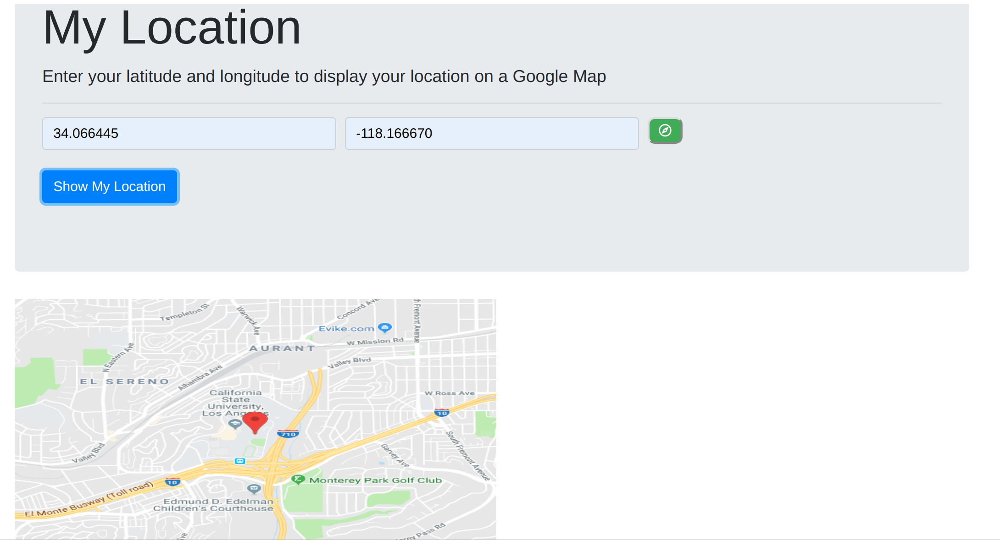

# MyLocation - Scaffolding single page application by Vue CLI
## Installation
npm install -g @vue/cli

npm install -g @vue/cli-init

vue init webpack-simple my-projectname(automatically update app when you edit)

go to my-project directory,npm install

npm run build(for creating dist folder)

npm run dev(each time run app)

## structure
1.index.html (just basic structure)

2.App.vue (parent node here, also can add child component here)

v-on:click = @click; v-bind:ele = :ele; 

logic: parent control whole app, child component should send data(its props & method) to parent node, parent can add extra return value and process child's data. In whole template, child customized component tag whould bind with parent's. And I use some event modifier stop and prevent let event’s propagation will be stopped and no longer reload the page that help to improve web page loading efficiency.

